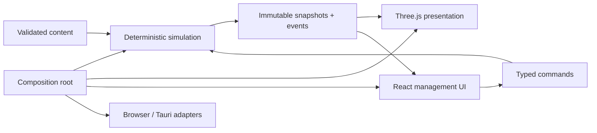

# Architecture

Last updated: 2026-08-08

## Goals

The architecture must support a deterministic, explainable station simulation; a readable isometric 2.5D presentation; authored plus generated data; versioned local saves; and a Windows desktop build without depending on a visual game-engine editor.

## Current structure

```text
.
├── .codex/                  # Project agent configuration; all specialists read-only
├── .github/workflows/       # Automated verification
├── docs/                    # GDD and durable production records
├── scripts/                 # Reproducible build orchestration
├── src/
│   ├── components/          # Reusable accessible presentation primitives
│   ├── config/              # Player-facing metadata and composition settings
│   ├── content/             # Validated content schemas and Great Plains data
│   ├── game/
│   │   ├── presentation/    # Domain-event selectors and player-facing copy
│   │   ├── rendering/       # Three.js projection; no domain authority
│   │   ├── runtime/         # Browser cadence and typed UI command adapter
│   │   ├── scenarios/       # Validated content-to-simulation composition
│   │   └── simulation/      # Pure domain state, clock, and transitions
│   ├── test/                # Shared test setup
│   ├── App.tsx              # Current UI/composition root
│   └── main.tsx             # Browser entry
└── src-tauri/               # Thin Windows desktop shell and capabilities
```

The repository begins as one TypeScript package so dependency rules remain visible. Split stable domains into workspaces only when size or independent build/test boundaries justify the overhead.

## Dependency rule



Forbidden dependencies:

- simulation → React, Three.js, DOM, Tauri, filesystem, wall clock, or uncontrolled randomness;
- content schema → rendered scene objects;
- UI → direct mutation of authoritative state;
- save keys/schema IDs → player-facing working title.

## Simulation model

The M1 core uses or will expand:

- a fixed tick and explicit phase state machine;
- stable entity IDs and plain serializable component stores;
- typed player/system commands with validation;
- ordered reason-coded domain events;
- injected seeded RNG with serializable state;
- deterministic grid occupancy, movement, range, and line-of-sight;
- immutable external snapshots/selectors;
- state hashing and command replay for regression tests.

GS-010 established the clock kernel: one engine step represents 100,000 real microseconds, and authoritative time uses 40 integer clock units per simulation minute. Slow, normal, and daytime-fast rates advance 3, 12, and 48 clock units per full step respectively; a step crossing a phase boundary apportions its remaining integer time at the new phase's effective rate and carries only an integer sub-unit remainder. Night caps fast mode at the normal rate and canonicalizes pause requests to slow. The browser owns the elapsed-time accumulator, caps work per pump without dropping debt, and discards hidden/paused catch-up time. Simulation state contains no wall-clock timestamp or floating-point time remainder.

GS-011 adds a pure exhaustive command dispatcher around typed envelopes. A command receipt records identity, scheduled tick, accepted/rejected status, stable reason, whether state changed, and any emitted event sequences. Valid no-op commands are accepted without events; malformed, mistimed, unsupported, or post-completion commands are rejected without mutation. `time-mode.set`, `job.assign`, `job.cancel`, `retail.price.set`, and `inventory.order` use the same dispatcher; future gameplay work extends the union instead of bypassing it.

The authoritative `eventLedger` is complete for the active scenario and has an independent monotonic `nextEventSequence`. Events contain typed facts and reason codes for scenario start, time-mode change, phase entry, resource change, night completion, and slice completion. Resource events retain before, requested delta, applied delta, and after values in stable resource-key order. Events caused at a clock boundary use the exact crossed clock unit; sequence resolves events sharing a tick and boundary. Presentation maps events to copy/tone and selects the latest eight without truncating state. Mechanical tick/clock-unit increments are ordering substrate rather than domain events.

GS-012 adds project-owned xoshiro128** randomness. Authoritative state retains the original scenario seed plus the current RNG algorithm/version, four uint32 words, and raw draw count. Initialization uses the complete non-negative safe-integer seed, while every draw is pure and returns replacement state. Bounded integer, index, choice, and ratio helpers have fixed draw-consumption rules; modulo bias is avoided through rejection sampling. Simulation lint rejects `Math.random()`. RNG movement is mechanical substrate rather than a domain event; future random outcomes must emit their meaningful resolved facts.

Scenario replay version 6 pins replay kind/version, scenario ID/version, station-grid ID/version, RNG algorithm/version/seed, target night count, command stream, and stop tick. It validates the complete envelope against an injected scenario definition before initialization, executes time, job, retail-price, inventory, and construction commands by tick and sequence, and reports consumed/unconsumed command IDs, receipts, final RNG, an explicit stop reason, full state, and independent state/ledger diagnostic hashes. Repeated runs compare full state and ledger rather than trusting hashes alone, including attributed service, canonical RNG consumption, construction identities, costs, and occupancy. The GS-010 clock replay remains an explicit version-1 compatibility adapter and rejects later command variants.

GS-013 adds a zero-based 32×24 station grid whose `x` coordinate increases east and `z` increases south. Row-major numeric indexes, rectangular quarter-turn footprints, authored plot reservations, flexible-build regions, and one exclusive structural occupancy layer are pure domain rules. Authoritative state stores only a grid definition ID/version plus canonically ID-sorted placement facts; cell indexes and expanded footprints are derived. Empty authored plots remain reserved. Great Plains content enters through `game/scenarios` composition, while simulation modules remain independent of region files.

GS-022 makes construction content-owned and command-driven. A construction command supplies only a blueprint ID and either an authored plot or flexible origin/rotation; it cannot inject footprint, cost, facility identity, affected cells, or placement identity. One pure evaluator derives those facts for both UI previews and authoritative dispatch, accumulates deterministic grid/resource/current-crew/active-route blockers, and applies a successful placement atomically with an ordered `built-{blueprint}-{sequence}` identity. Great Plains costs and footprints are explicit provisional slice tuning because the GDD names required structures without numeric values. Placed objects are structural shells only until their later power, defense, storage, gate, repair, or utility systems exist.

GS-023 adds content-owned construction access with one anchor work target and a canonical required-target set. A hypothetical geometrically valid placement must leave at least one open interaction cell for the Beacon, checkout, garage plot, and pumps; each target's open cells and every current employee cell must remain four-way connected to checkout. The existing deterministic station pathfinder is the only movement authority. Active persisted routes remain strictly protected even when an alternate path exists. Every accepted construction prefix and final state is re-evaluated during semantic validation. Gates remain solid blockers until open/closed/locked behavior is implemented, so preview cannot approve a route that job assignment would reject. Customer, vehicle, threat, evacuation, route-width, terrain-cost, and utility connectivity remain later systems.

GS-014 places all four employees through validated scenario data and represents activity as `idle`, `traveling`, or `working`. Jobs reference work targets, which reference an occupant or authored plot and declare walkable cardinally adjacent interaction cells. Breadth-first search uses structural occupancy as blockers, permits employees to share/pass through cells, and resolves equal paths by north/west/east/south neighbor order plus row-major destination order. A path excludes its start and includes its destination. Travel consumes exactly 20 authoritative clock units per cell; work consumes its authored duration one clock unit at a time. Reassignment is explicit cancellation followed by a new assignment, so current position and travel cost are preserved. GS-021 adds authored service skills/fatigue without changing travel or generic job duration; job outputs remain later systems.

GS-020 adds one authoritative routine-customer business state. Authored disjoint traffic windows decide arrival clock units; customer sequence deterministically derives requested fuel and food without RNG. Customers move through a pump queue/service and, when food is requested, checkout queue/service. Staffing is derived from employees actively working `staff-pumps` and `staff-checkout`. Service snapshots the selected integer price, consumes the existing resource store, adds exact cash, and emits enough before/after facts to reconcile every sale. Patience, departures, theft, multiple lanes, and important travelers remain deferred rather than hidden in the initial loop.

GS-021 authors complete pump/checkout skill pairs for each initial employee and bounds skill at 0–5 plus fatigue at 0–100. A pure integer-permille performance calculation snapshots base duration/error chance, skill reductions, fatigue-tier penalties, final duration/chance, canonical RNG roll/draw count, attributed employee, and optional rework delay when service starts. Pump service starts before checkout when both become available, fixing RNG draw order. Active progress uses the snapshot; loss of the attributed staffing job emits `service.interrupted` and requeues the customer before another worker can start it. Error rework consumes time only, so sale arithmetic remains unchanged and independently reconcilable.

Checkpoint version 8 includes scenario identity, complete RNG continuation state, canonical station occupancy, workforce positions, canonical service skills, activities, business prices, attributed active-service performance, the full ledger, and independent event/construction sequence cursors; it deeply detaches nested snapshots, canonicalizes object keys, preserves semantic array order, and excludes presentation copy. Checkpoint creation validates active job references, route bounds/blocking/continuity/cursor, interaction destinations, durations, assignment uniqueness, customer identity/demand/stage, exact performance formulas/draw ordering/interruption history, price bounds, exact blueprint geometry/costs, every historical/final required-access invariant, construction history, and business/resource ledger reconciliation against the injected scenario context. Scenario content advances to version 7 for the new placement semantics; replay envelope v6, checkpoint v8, and save schema v4 retain their shapes. Checkpoints and replays remain deterministic diagnostics; save schema v4 embeds checkpoint v8 behind its own strict compatibility and semantic load boundary.

## Content model

Zod validates content at startup and will validate saves on load. Technical IDs use stable kebab-case keys, while names and descriptions are player-facing data. Region, building, item, employee, traveler, threat, dialogue, and event schemas should reference other content by ID and fail with actionable validation paths.

Major story content remains authored. Generated employees/travelers will combine validated templates and traits, and every generated result must stay explainable and valid.

## Rendering and UI

Three.js owns scene projection, camera, lighting, meshes, particles, picking, overlays, and animation adapters. The initial renderer uses an orthographic camera and procedural placeholder geometry. Because the current scene is static, one retained renderer redraws only on initialization, resize, or a derived visual-state change; it does not run a perpetual animation frame. Geometry and materials are scene-owned and disposed with the observer, renderer, and canvas on unmount. Future motion will consume immutable simulation snapshots and add an animation loop only when measured presentation needs justify it.

The GS-022 construction dialog projects the shared pure evaluator into blueprint, placement, exact cost, affected-cell, and rejection feedback. Accepted authoritative `built-*` occupants render in a retained scene-owned construction group as generic geometry, with disposal and renderer reuse verified when occupancy changes. The scene does not infer gameplay from mesh state, and the modal does not retain a second placement model.

React owns panels, alerts, dialogue, settings, focus, and transient selection affordances. UI sends commands instead of changing simulation objects. Critical state uses text/shape plus color and remains readable without decorative CRT interference.

GS-017 separates browser cadence and typed UI-command dispatch into `game/runtime`, leaving `App` as the composition root. A shared portal-based modal primitive supplies dialog and drawer variants with background inertness, focus containment/return, Escape and backdrop dismissal, body-scroll ownership, and narrow-screen sheet behavior. The station guide and newest-first event-history drawer are non-authoritative projections over simulation state. Responsive layout reorders the world before secondary panels below 900 px, wraps essential resources below 660 px, and keeps semantic meters plus grouped pressed-state time controls.

GS-018 derives `StationVisualState` from authoritative phase and power once; both HUD and Three.js consume that same value. A pure style selector pins day, dusk, and night atmosphere plus stable, critical, and dark Beacon output, including zero light/emission when dark. A development-only query fixture renders all nine combinations for browser review but is removed from production builds. These are presentation foundations, not completion of the representative-art gate in GS-054.

Renderer selection is provisional. Measure target-scale lighting, instancing, selection, occlusion, and night readability before DEC-003 becomes a permanent commercial-engine commitment.

## Persistence

GS-015/020/021/022 define canonical UTF-8 JSON save schema v4 under the generic `station-campaign-save` format ID. The envelope separates minimal campaign progress, checkpoint-v8 station state, the next runtime command sequence, versioned settings/difficulty namespaces, explicit scenario/grid/RNG compatibility, and recovery metadata. Set-like campaign IDs are unique and lexical; event, path, customer, skill, construction, and RNG arrays retain semantic order. Player-facing title, UI/modal state, rendering objects, wall-clock timestamps, runner debt, receipts, and localized event prose are excluded. Retained v1/checkpoint-v5, v2/checkpoint-v6, v3/checkpoint-v7, and initial v4/checkpoint-v8 fixtures migrate scenario v3/v4/v5/v6 saves forward. V1 removes retired placeholder daytime flows and initializes future traffic; V2 authors canonical employee skills and requeues any active legacy service at an explicit future performance baseline so migration never fabricates prior modifier or RNG facts; V3 initializes the construction cursor to zero because construction did not yet exist. Scenario-v6 v4 saves have one explicit migration edge to scenario v7 and advance only when their layout satisfies the scenario-v7 access policy; an unsafe layout receives `legacy-layout-strands-required-route` rather than silent demolition or refund. A future scenario version must add its own sequential migration edge instead of relabeling a v6 save across multiple versions.

Encoding snapshots and validates without mutating live state. Loading is all-or-nothing: header dispatch rejects unknown formats/versions, strict Zod schemas reject missing/extra/malformed fields, the FNV-1a checksum detects ordinary corruption, and semantic validation reconciles phase/night boundaries, scheduled resources, time-mode history, clock-exact job lifecycles/progress, workforce, occupancy, RNG, and the full ledger before returning fresh state. Version 1 caps a persisted scenario at 32 nights—above a full 21-night chapter—and bounds the corresponding clock before any history walk, preventing attacker-controlled numeric horizons from creating unbounded validation work. Checksums are corruption signals, not security boundaries. Future save-schema migrations must be pure sequential version steps with retained fixtures; content and RNG compatibility require explicit migration/support rather than best-effort reseeding.

GS-016 defines three fixed logical recovery slots behind a narrow dependency-injected storage boundary: read one known slot or atomically replace one known slot. Writes are serialized, abort if any slot is unreadable, fill empty slots before invalid and oldest-valid slots, derive a monotonic sequence only from fully decoded candidates, and verify the exact bytes by decoding a read-back before reporting success. Loading examines every slot, selects the highest valid sequence with stable slot-order ties, and reports codec corruption separately from storage I/O failures. No failure path rewrites a second slot.

Dusk and morning autosaves are selected from newly observed authoritative phase events and coalesce missed boundaries to one current-state snapshot. Major choices have a validated trigger seam until their command type exists. Startup gates clock and command input until recovery resolves; loaded runtime adoption preserves campaign, simulation, and the command cursor while resetting non-authoritative runner debt, command feedback, and the autosave event cursor. Transient storage failures receive four bounded exponential-delay attempts, including stationary dusk/terminal states, while stale concurrent snapshots are rejected against monotonic command, clock, event, tick, and RNG-draw progress. The Tauri adapter resolves the application data directory internally, accepts only the three fixed slot IDs, rejects reads and writes above 16 MiB, serializes compare-and-replace transactions under one process lock, flushes a same-directory pending file, and atomically renames it over the target. Frontend code receives no arbitrary filesystem capability or path. Browser development remains intentionally ephemeral.

## Platform and security

The Vite build is the primary development surface. Tauri packages the same assets for Windows and starts with `core:default` capabilities only. Production is offline-first: no runtime web fonts, telemetry, account, cloud save, or external content requirement. Add capabilities narrowly and only when a backlog item demonstrates need.

## Verification layers

1. Prettier and ESLint for consistent, reviewable source.
2. Strict TypeScript for boundary and exhaustiveness errors.
3. Vitest unit/integration checks for deterministic domain behavior and content schemas.
4. Coverage guardrails for simulation/content; save migrations require explicit coverage.
5. Vite production build for deployable browser assets.
6. Cargo/Tauri release build for Windows shell integration.
7. Fixed-seed scenarios, UI automation, visual baselines, and packaged smoke tests as their systems arrive.
