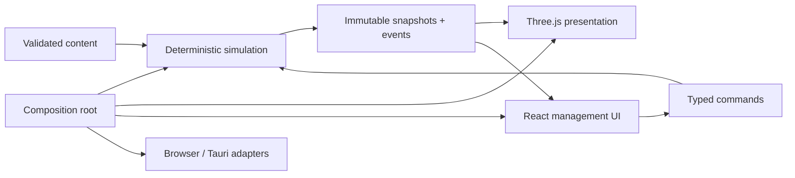

# Architecture

Last updated: 2026-08-06

## Goals

The architecture must support a deterministic, explainable station simulation; a readable isometric 2.5D presentation; authored plus generated data; versioned local saves; and a Windows desktop build without depending on a visual game-engine editor.

## Current structure

```text
.
├── .codex/                  # Project agent configuration; all specialists read-only
├── .github/workflows/       # Automated verification
├── docs/                    # GDD and durable production records
├── scripts/                 # Reproducible build orchestration
├── src/
│   ├── config/              # Player-facing metadata and composition settings
│   ├── content/             # Validated content schemas and Great Plains data
│   ├── game/
│   │   ├── presentation/    # Domain-event selectors and player-facing copy
│   │   ├── rendering/       # Three.js projection; no domain authority
│   │   └── simulation/      # Pure domain state, clock, and transitions
│   ├── test/                # Shared test setup
│   ├── App.tsx              # Current UI/composition root
│   └── main.tsx             # Browser entry
└── src-tauri/               # Thin Windows desktop shell and capabilities
```

The repository begins as one TypeScript package so dependency rules remain visible. Split stable domains into workspaces only when size or independent build/test boundaries justify the overhead.

## Dependency rule



Forbidden dependencies:

- simulation → React, Three.js, DOM, Tauri, filesystem, wall clock, or uncontrolled randomness;
- content schema → rendered scene objects;
- UI → direct mutation of authoritative state;
- save keys/schema IDs → player-facing working title.

## Simulation model

The M1 core uses or will expand:

- a fixed tick and explicit phase state machine;
- stable entity IDs and plain serializable component stores;
- typed player/system commands with validation;
- ordered reason-coded domain events;
- injected seeded RNG with serializable state;
- deterministic grid occupancy, A* movement, range, and line-of-sight;
- immutable external snapshots/selectors;
- state hashing and command replay for regression tests.

GS-010 established the clock kernel: one engine step represents 100,000 real microseconds, and authoritative time uses 40 integer clock units per simulation minute. Slow, normal, and daytime-fast rates advance 3, 12, and 48 clock units per full step respectively; a step crossing a phase boundary apportions its remaining integer time at the new phase's effective rate and carries only an integer sub-unit remainder. Night caps fast mode at the normal rate and canonicalizes pause requests to slow. The browser owns the elapsed-time accumulator, caps work per pump without dropping debt, and discards hidden/paused catch-up time. Simulation state contains no wall-clock timestamp or floating-point time remainder.

GS-011 adds a pure exhaustive command dispatcher around typed envelopes. A command receipt records identity, scheduled tick, accepted/rejected status, stable reason, whether state changed, and any emitted event sequences. Valid no-op commands are accepted without events; malformed, mistimed, unsupported, or post-completion commands are rejected without mutation. Only `time-mode.set` exists today, so future gameplay work extends the union instead of bypassing the dispatcher.

The authoritative `eventLedger` is complete for the active scenario and has an independent monotonic `nextEventSequence`. Events contain typed facts and reason codes for scenario start, time-mode change, phase entry, resource change, night completion, and slice completion. Resource events retain before, requested delta, applied delta, and after values in stable resource-key order. Events caused at a clock boundary use the exact crossed clock unit; sequence resolves events sharing a tick and boundary. Presentation maps events to copy/tone and selects the latest eight without truncating state. Mechanical tick/clock-unit increments are ordering substrate rather than domain events.

Checkpoint version 2 includes the complete ledger and sequence cursor, canonicalizes object keys, preserves semantic array order, and excludes presentation copy. The clock replay fixture consumes dispatch receipts and the authoritative ledger directly. It remains a regression foundation rather than a save format; GS-012 adds serializable RNG and scenario-level replay.

## Content model

Zod validates content at startup and will validate saves on load. Technical IDs use stable kebab-case keys, while names and descriptions are player-facing data. Region, building, item, employee, traveler, threat, dialogue, and event schemas should reference other content by ID and fail with actionable validation paths.

Major story content remains authored. Generated employees/travelers will combine validated templates and traits, and every generated result must stay explainable and valid.

## Rendering and UI

Three.js owns scene projection, camera, lighting, meshes, particles, picking, overlays, and animation adapters. The initial renderer uses an orthographic camera and procedural placeholder geometry. It will later consume immutable simulation snapshots and interpolate visually between fixed ticks.

React owns panels, alerts, dialogue, settings, focus, and transient selection affordances. UI sends commands instead of changing simulation objects. Critical state uses text/shape plus color and remains readable without decorative CRT interference.

Renderer selection is provisional. Measure target-scale lighting, instancing, selection, occlusion, and night readability before DEC-003 becomes a permanent commercial-engine commitment.

## Persistence

Persistence is not implemented yet. The first schema must include:

- explicit save format and content version;
- separate campaign and current-station state;
- authoritative simulation state and tick;
- RNG state;
- ordered event-sequence position;
- settings and difficulty;
- stable content IDs;
- checksum/recovery metadata.

Autosaves occur at morning, dusk, and major choices. Rotating slots must recover from a corrupt newest save. Save/load boundaries must not change deterministic outcomes.

## Platform and security

The Vite build is the primary development surface. Tauri packages the same assets for Windows and starts with `core:default` capabilities only. Production is offline-first: no runtime web fonts, telemetry, account, cloud save, or external content requirement. Add capabilities narrowly and only when a backlog item demonstrates need.

## Verification layers

1. Prettier and ESLint for consistent, reviewable source.
2. Strict TypeScript for boundary and exhaustiveness errors.
3. Vitest unit/integration checks for deterministic domain behavior and content schemas.
4. Coverage guardrails for simulation/content; save migrations require explicit coverage.
5. Vite production build for deployable browser assets.
6. Cargo/Tauri release build for Windows shell integration.
7. Fixed-seed scenarios, UI automation, visual baselines, and packaged smoke tests as their systems arrive.
